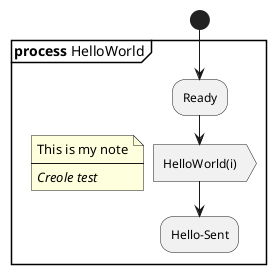
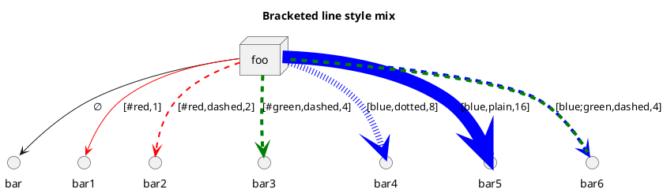
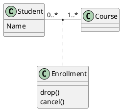

# Some diagrams

Some home rolled diagrams

```plantuml
@startuml
start
partition "**process** HelloWorld" {
    note
        This is my note
        ----
        //Creole test//
    end note
    :Ready;
    :HelloWorld(i)>
    :Hello-Sent;
}
@enduml
```

```plantuml

@startuml
title Bracketed line style mix
node foo
foo --> bar                             : ∅
foo -[#red,thickness=1]-> bar1          : [#red,1]
foo -[#red,dashed,thickness=2]-> bar2   : [#red,dashed,2]
foo -[#green,dashed,thickness=4]-> bar3 : [#green,dashed,4]
foo -[#blue,dotted,thickness=8]-> bar4  : [blue,dotted,8]
foo -[#blue,plain,thickness=16]-> bar5  : [blue,plain,16]
foo -[#blue;#green,dashed,thickness=4]-> bar6  : [blue;green,dashed,4]
@enduml

```

```plantuml
@startuml
class Student {
  Name
}
Student "0..*" - "1..*" Course
(Student, Course) .. Enrollment

class Enrollment {
  drop()
  cancel()
}
@enduml
```